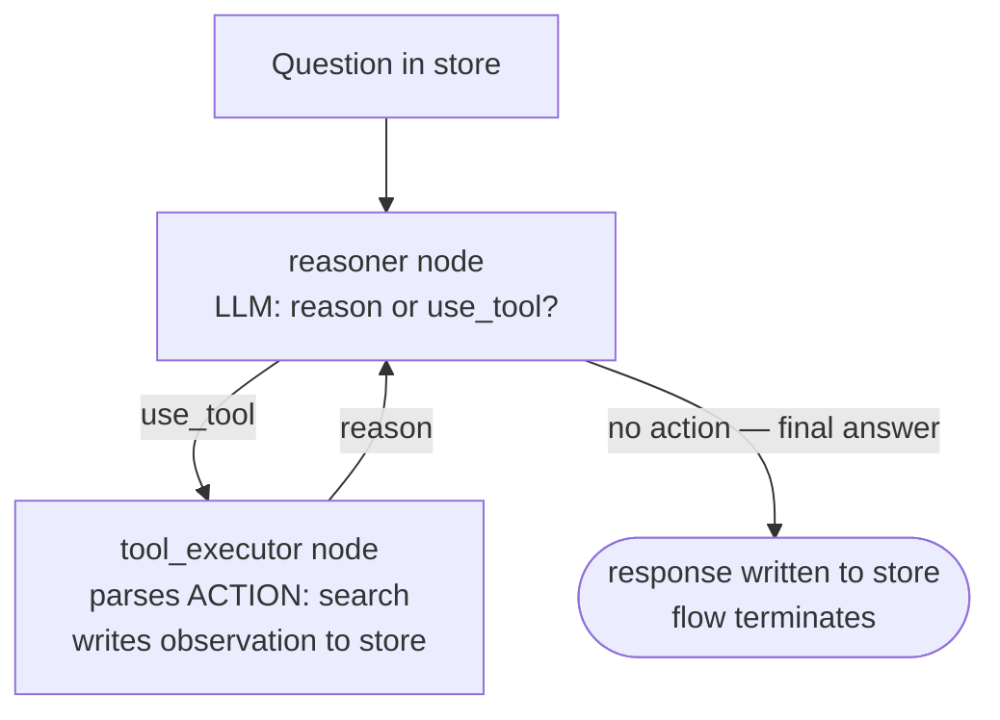

# ReAct Agent

## What this example is for

This example demonstrates the `ReAct Agent` pattern in AgentFlow.

**Primary AgentFlow pattern:** `ReAct`  
**Why you would use it:** alternate reasoning and acting with observations.

## How the example works

1. A **reasoner** node calls an LLM with a `SYSTEM` prompt that defines a `search(query)` tool. The LLM either emits `ACTION: search(...)` (wants to call the tool) or a final answer.
2. The reasoner writes `action = "use_tool"` when a tool call is detected, or writes `"response"` and stops when a final answer is produced.
3. A **tool_executor** node parses the tool call, simulates a web-search result, writes `"observation"` to the store, and sets `action = "reason"` to loop back.
4. The cycle repeats until the LLM produces a final answer or `with_max_steps(20)` is reached (2 nodes/cycle → max 10 tool calls).

## Execution diagram



**AgentFlow patterns used:** `Flow` · `create_node` · `with_max_steps(20)` · ReAct cycle via `add_edge("reasoner", "use_tool", "tool_executor")` + `add_edge("tool_executor", "reason", "reasoner")`

## Key implementation details

- The example source is `examples/react.rs`.
- It uses AgentFlow primitives to move data through a store, flow, or higher-level pattern wrapper.
- The implementation is meant to be adapted by swapping in your own prompts, tool handlers, retrieval logic, or business rules.
- When an LLM provider is used, the example relies on `rig` and environment-provided credentials.

## Build your own with this pattern

Use the same pattern in your own project like this:

```rust
let mut flow = Flow::new().with_max_steps(20);
flow.add_node("reasoner", reasoner_node);
flow.add_node("tool_executor", tool_exec_node);
flow.add_edge("reasoner", "use_tool", "tool_executor");
flow.add_edge("tool_executor", "reason", "reasoner");
let result = flow.run(store).await;
```

### Customization ideas

- Use this when you need to alternate reasoning and acting with observations.
- Replace the demo prompts, tools, or handlers with your application logic.
- Persist or forward the final result at your system boundary.

## How to run

```bash
cargo run --example react
```

## Requirements and notes

Requires provider credentials and any tools you want the agent to call.
