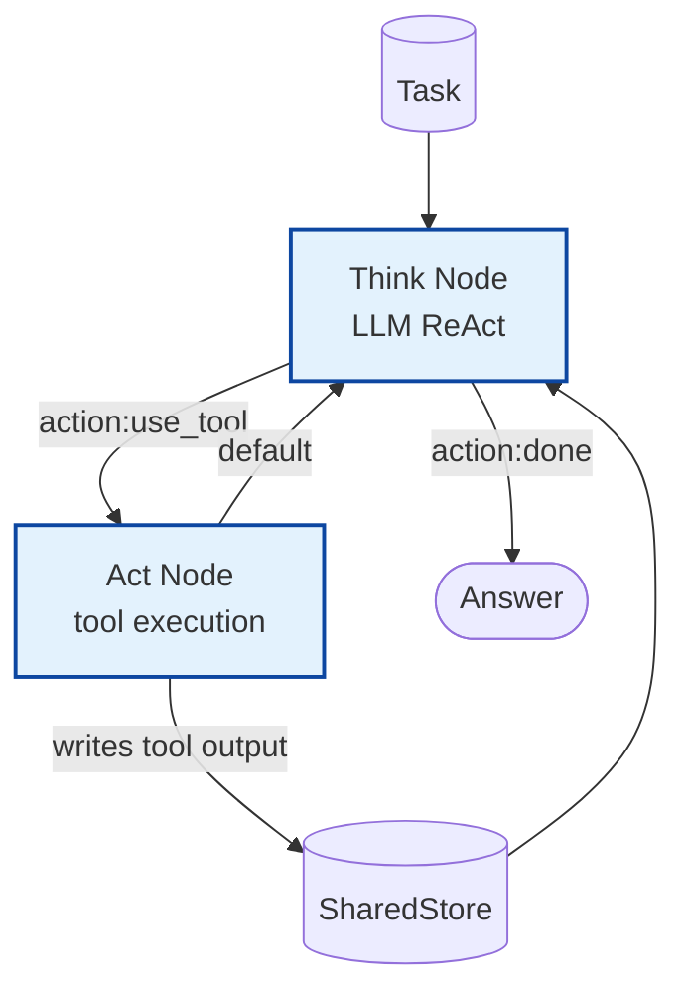

# Example: react

*This documentation is generated from the source code.*

# Example: react.rs

**Purpose:**
Implements a ReAct (Reason + Act) agent loop using AgentFlow's `Flow` and `create_tool_node`.

**How it works:**
1. **Think node** — LLM receives the task and current context; emits `ACTION: <tool>` or `ANSWER: <result>`.
2. **Act node** — Executes the tool named in `ACTION` via `create_tool_node`; writes output to the store.
3. **Flow routing** — `"use_tool"` edge sends execution to the act node; `"done"` edge terminates.
4. **Loop** — Act node's default edge returns to the think node, which reads the tool output and reasons further.
5. `flow.with_max_steps(20)` guards against infinite loops.

**How to adapt:**
- Replace `create_tool_node` with `ToolRegistry` for production use to prevent LLM-injected tool names.
- Use `create_diff_node` inside the think node to read the store snapshot without holding the lock during the LLM call.
- Add more tools by registering additional `create_tool_node` instances and branching in the flow.

**Requires:** `OPENAI_API_KEY`
**Run with:** `cargo run --example react`

---

## Implementation Architecture

