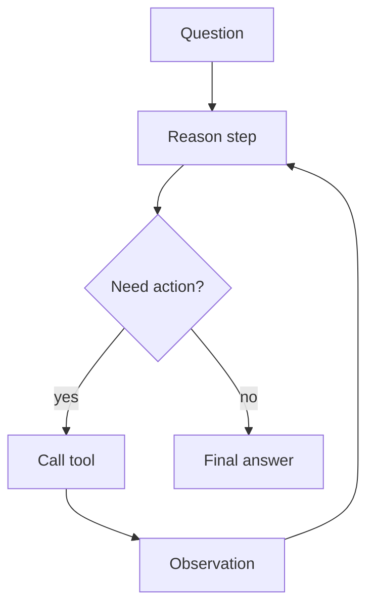

# ReAct Agent

## What this example is for

This example demonstrates the `ReAct Agent` pattern in AgentFlow.

**Primary AgentFlow pattern:** `ReAct`  
**Why you would use it:** alternate reasoning and acting with observations.

## How the example works

1. Real-world ReAct (Reason + Act) agent. The LLM decides each turn whether
2. to call a tool or emit a final answer. Tool execution is a real shell command
3. Run with: cargo run --example react
4. const SYSTEM: &str = r#"You are a reasoning agent. You have one tool:
5. search(query) — returns a web-search snippet.
6. .unwrap_or("")

## Execution diagram



## Key implementation details

- The example source is `examples/react.rs`.
- It uses AgentFlow primitives to move data through a store, flow, or higher-level pattern wrapper.
- The implementation is meant to be adapted by swapping in your own prompts, tool handlers, retrieval logic, or business rules.
- When an LLM provider is used, the example relies on `rig` and environment-provided credentials.

## Build your own with this pattern

Use the same pattern in your own project like this:

```rust
let react_agent = Workflow::new()
    .then(reason_node)
    .then(tool_action_node)
    .then(observation_node);
```

### Customization ideas

- Use this when you need to alternate reasoning and acting with observations.
- Replace the demo prompts, tools, or handlers with your application logic.
- Persist or forward the final result at your system boundary.

## How to run

```bash
cargo run --example react
```

## Requirements and notes

Requires provider credentials and any tools you want the agent to call.
