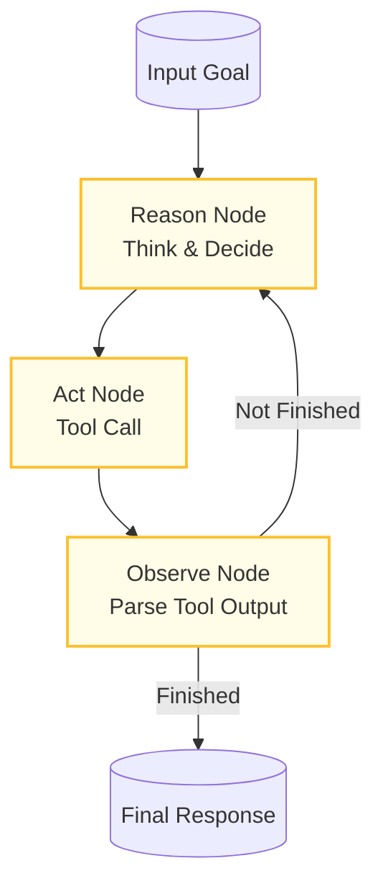

# Example: react

*This documentation is automatically generated from the source code.*

# Example: react.rs

Real-world ReAct (Reason + Act) agent. The LLM decides each turn whether
to call a tool or emit a final answer. Tool execution is a real shell command
(curl-based web fetch is simulated here — swap for any HTTP call).

Requires: OPENAI_API_KEY
Run with: cargo run --example react

## Implementation Architecture

