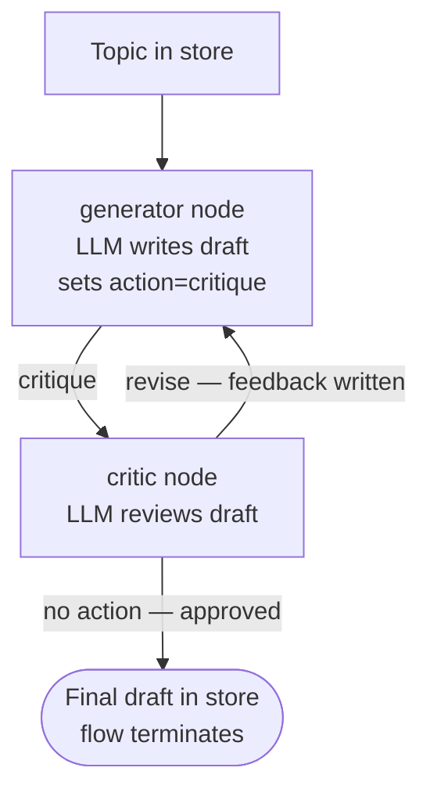

# Reflection Loop

## What this example is for

This example demonstrates the `Reflection Loop` pattern in AgentFlow.

**Primary AgentFlow pattern:** `Reflection loop`  
**Why you would use it:** critique and improve an answer iteratively.

## How the example works

1. A **generator** node calls an LLM to write a draft (e.g., a Rust technical article) and writes it to the store. It sets `action = "critique"` to route to the critic.
2. A **critic** node calls an LLM to review the draft. If revision is needed it writes feedback and sets `action = "revise"` to loop back to the generator. Otherwise it sets no action and the flow terminates.
3. The cycle repeats until the critic approves or `with_max_steps(12)` is reached (2 nodes/cycle → max 6 revision rounds).

## Execution diagram



**AgentFlow patterns used:** `Flow` · `create_node` · `with_max_steps(12)` · reflection cycle via `add_edge("generator", "critique", "critic")` + `add_edge("critic", "revise", "generator")`

## Key implementation details

- The example source is `examples/reflection.rs`.
- It uses AgentFlow primitives to move data through a store, flow, or higher-level pattern wrapper.
- The implementation is meant to be adapted by swapping in your own prompts, tool handlers, retrieval logic, or business rules.
- When an LLM provider is used, the example relies on `rig` and environment-provided credentials.

## Build your own with this pattern

Use the same pattern in your own project like this:

```rust
let mut flow = Flow::new().with_max_steps(12);
flow.add_node("generator", generator_node);
flow.add_node("critic", critic_node);
flow.add_edge("generator", "critique", "critic");
flow.add_edge("critic", "revise", "generator");
let result = flow.run(store).await;
```

### Customization ideas

- Use this when you need to critique and improve an answer iteratively.
- Replace the demo prompts, tools, or handlers with your application logic.
- Persist or forward the final result at your system boundary.

## How to run

```bash
cargo run --example reflection
```

## Requirements and notes

Usually requires provider credentials because the answer and critique steps are model-backed.
