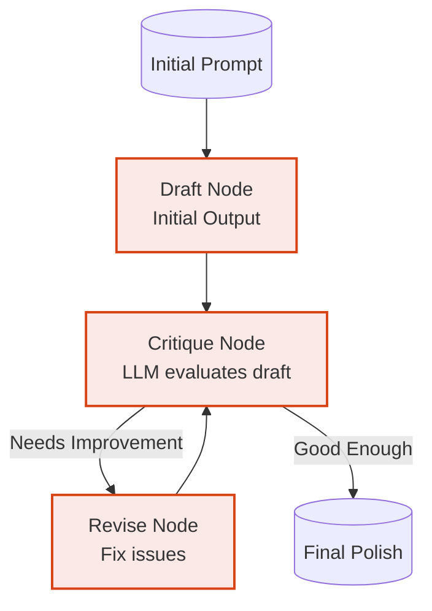

# Example: reflection

*This documentation is automatically generated from the source code.*

# Example: reflection.rs

Real-world Reflection pattern. A Generator LLM writes a draft; a Critic LLM
reviews it and either approves or sends it back with specific feedback. The
loop continues until the Critic approves or max_steps is reached.

Domain: technical blog post paragraph about Rust's ownership model.

Requires: OPENAI_API_KEY
Run with: cargo run --example reflection

## Implementation Architecture

