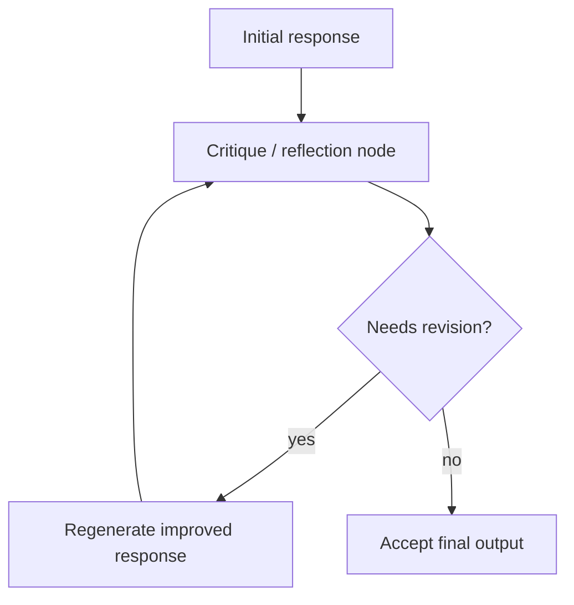

# Reflection Loop

## What this example is for

This example demonstrates the `Reflection Loop` pattern in AgentFlow.

**Primary AgentFlow pattern:** `Reflection loop`  
**Why you would use it:** critique and improve an answer iteratively.

## How the example works

1. Real-world Reflection pattern. A Generator LLM writes a draft; a Critic LLM
2. Run with: cargo run --example reflection
3. const GENERATOR_SYSTEM: &str = "You are a technical writer specialising in Rust. \
4. ── Generator ────────────────────────────────────────────────────────────
5. .unwrap_or("")
6. g.get("attempt").and_then(|v| v.as_u64()).unwrap_or(0),

## Execution diagram



## Key implementation details

- The example source is `examples/reflection.rs`.
- It uses AgentFlow primitives to move data through a store, flow, or higher-level pattern wrapper.
- The implementation is meant to be adapted by swapping in your own prompts, tool handlers, retrieval logic, or business rules.
- When an LLM provider is used, the example relies on `rig` and environment-provided credentials.

## Build your own with this pattern

Use the same pattern in your own project like this:

```rust
let reflection_loop = Workflow::new()
    .then(draft_node)
    .then(critique_node)
    .then(revise_node);
```

### Customization ideas

- Use this when you need to critique and improve an answer iteratively.
- Replace the demo prompts, tools, or handlers with your application logic.
- Persist or forward the final result at your system boundary.

## How to run

```bash
cargo run --example reflection
```

## Requirements and notes

Usually requires provider credentials because the answer and critique steps are model-backed.
