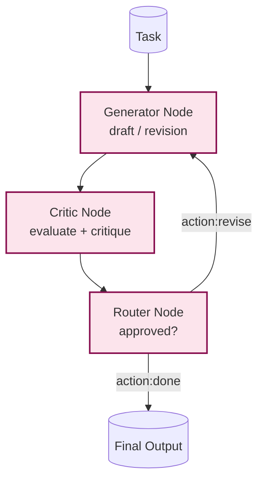

# Example: reflection

*This documentation is generated from the source code.*

# Example: reflection.rs

**Purpose:**
Demonstrates a self-improvement loop where a generator LLM produces a draft, a critic LLM evaluates it, and the generator revises until the critic is satisfied or a maximum number of iterations is reached.

**How it works:**
1. **Generator node** — Produces an initial draft (or revision incorporating critic feedback). Reads `critique` from the store if present.
2. **Critic node** — Evaluates the draft and writes `critique` and `approved` to the store.
3. **Router node** — Reads `approved`; sets `action = "done"` or `action = "revise"`.
4. **Flow** — routes `generate → critic → router → revise → generate` until `approved == true` or `max_steps` is reached.

**How to adapt:**
- Replace the critic with a rule-based validator for structured output verification.
- Add a `create_diff_node` in the generator for lock-safe store access during the LLM call.
- Use `create_corrective_retry_node` if the generator itself can fail transiently.

**Requires:** `OPENAI_API_KEY`
**Run with:** `cargo run --example reflection`

---

## Implementation Architecture

