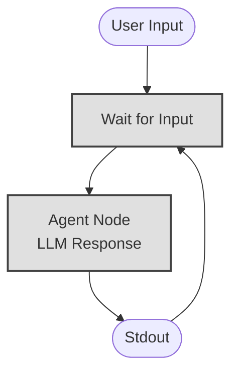

# Example: repl

*This documentation is automatically generated from the source code.*

# Example: repl.rs

Real-world LLM-powered REPL. The user types a message; an LLM answers;
the conversation history is kept in the store so the LLM has full context.

Type `exit` or `quit` to stop.

Requires: OPENAI_API_KEY
Run with: cargo run --example repl

## Implementation Architecture

