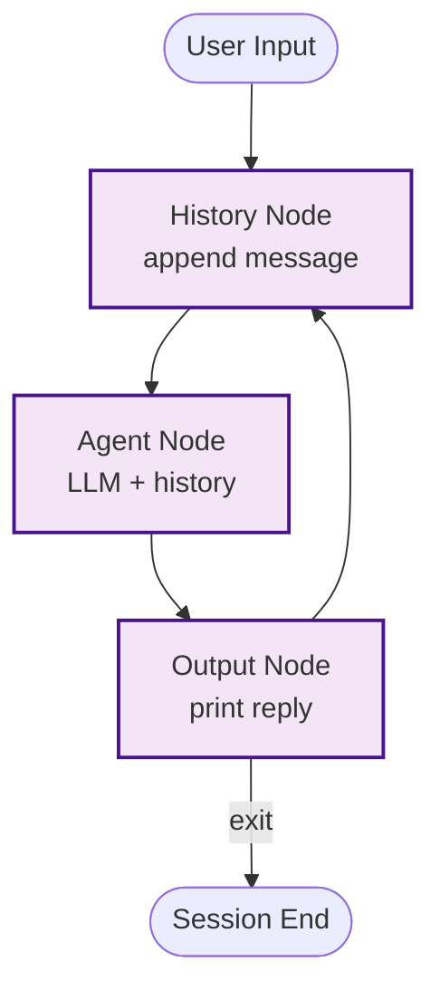

# Example: repl

*This documentation is generated from the source code.*

# Example: repl.rs

**Purpose:**
Demonstrates an interactive REPL (Read-Eval-Print Loop) powered by AgentFlow — the user types queries in the terminal and the LLM agent responds, maintaining conversation history across turns.

**How it works:**
1. **Input loop** — Reads user input from stdin (or `inquire` with `--features repl`).
2. **History node** — Appends the new user message to `history` in the store.
3. **Agent node** — LLM receives the full conversation history and produces a reply.
4. **Output node** — Prints the reply and appends it to `history`.
5. Loop continues until the user types `exit` or `quit`.

**How to adapt:**
- Swap the in-memory history for a persistent store (file, DB) to resume sessions.
- Add a system prompt node that injects persona instructions at the start of each turn.
- Combine with `ToolRegistry` to let the agent invoke tools mid-conversation.

**Requires:** `OPENAI_API_KEY`
**Run with:** `cargo run --example repl`

---

## Implementation Architecture

