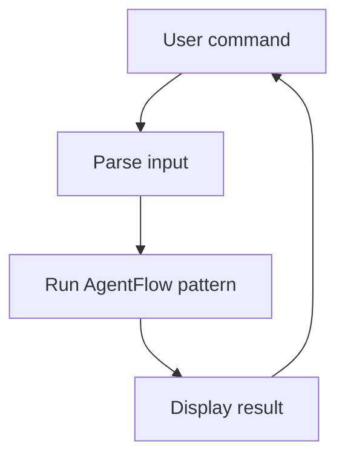

# Interactive REPL

## What this example is for

This example demonstrates the `Interactive REPL` pattern in AgentFlow.

**Primary AgentFlow pattern:** `REPL shell`  
**Why you would use it:** wrap AgentFlow patterns in an interactive loop.

## How the example works

1. Run with: cargo run --example repl
2. .unwrap_or("")
3. .unwrap_or_default();
4. flow.add_node("read", read_node);
5. flow.add_node("eval", eval_node);
6. flow.add_node("print", print_node);

## Execution diagram



## Key implementation details

- The example source is `examples/repl.rs`.
- It uses AgentFlow primitives to move data through a store, flow, or higher-level pattern wrapper.
- The implementation is meant to be adapted by swapping in your own prompts, tool handlers, retrieval logic, or business rules.
- When an LLM provider is used, the example relies on `rig` and environment-provided credentials.

## Build your own with this pattern

Use the same pattern in your own project like this:

```rust
loop {
    let line = read_user_input()?;
    if line == ":quit" { break; }
    let result = flow.run(user_store(line)).await?;
    println!("{}", render(result));
}
```

### Customization ideas

- Use this when you need to wrap AgentFlow patterns in an interactive loop.
- Replace the demo prompts, tools, or handlers with your application logic.
- Persist or forward the final result at your system boundary.

## How to run

```bash
cargo run --example repl
```

## Requirements and notes

Requirements depend on the pattern wired into the REPL session.
