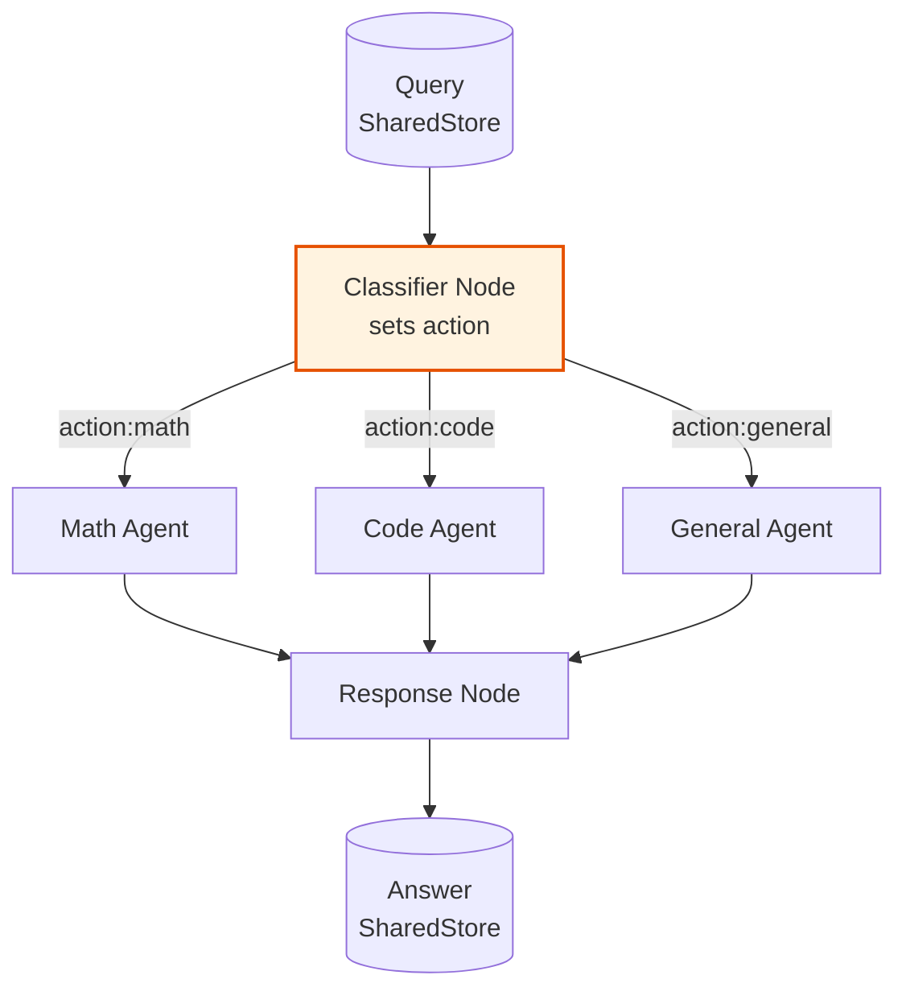

# Example: routing

*This documentation is generated from the source code.*

# Example: routing.rs

**Purpose:**
Demonstrates AgentFlow's labeled-edge routing — a classifier LLM reads the user query and sets `"action"` to route to the correct specialist handler.

**How it works:**
1. **Classifier node** — LLM reads the query and writes `action = "math" | "code" | "general"`.
2. `Flow` consumes the `"action"` key under a write lock and routes to the matching node.
3. Each specialist node (MathAgent, CodeAgent, GeneralAgent) produces its answer independently.
4. A final response node writes the answer to the store.

**How to adapt:**
- Add more specialist nodes (e.g., `"image"`, `"search"`) by adding edges and nodes to the flow.
- Use `TypedFlow<T>` with an enum `Route` instead of a string key for compile-time routing safety.
- Chain specialist nodes into sub-flows for complex multi-step handling.

**Requires:** `OPENAI_API_KEY`
**Run with:** `cargo run --example routing`

---

## Implementation Architecture



**Routing key pattern:**
```rust
// Inside classifier node
let mut w = store.write().await;
w.insert("action".to_string(), json!("math"));
drop(w);
// Flow consumes "action" on every transition — no state leak
```
