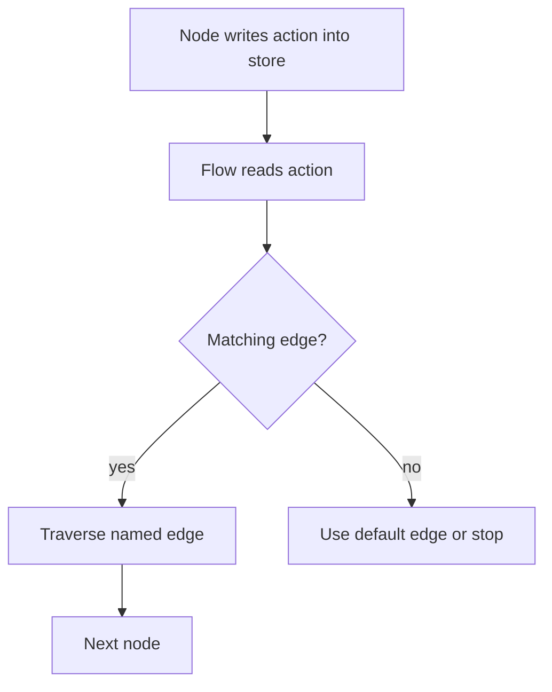

# Conditional Routing

## What this example is for

This example demonstrates the `Conditional Routing` pattern in AgentFlow.

**Primary AgentFlow pattern:** `Flow routing`  
**Why you would use it:** drive graph transitions with action keys in the store.

## How the example works

1. Real-world LLM-powered intent routing. A Triage node calls an LLM to classify
2. and routes it to the appropriate specialist agent — also LLM-backed.
3. Run with: cargo run --example routing
4. "You are a customer-service triage bot. Classify the message into exactly one category: \
5. "You are a helpful customer service agent. Respond to the customer's message \
6. ── Triage node: LLM classifies intent ───────────────────────────────────

## Execution diagram



## Key implementation details

- The example source is `examples/routing.rs`.
- It uses AgentFlow primitives to move data through a store, flow, or higher-level pattern wrapper.
- The implementation is meant to be adapted by swapping in your own prompts, tool handlers, retrieval logic, or business rules.
- When an LLM provider is used, the example relies on `rig` and environment-provided credentials.

## Build your own with this pattern

Use the same pattern in your own project like this:

```rust
let flow = Flow::new()
    .node("start", start_node)
    .node("approve", approve_node)
    .node("reject", reject_node)
    .edge("start", "approve", "approved")
    .edge("start", "reject", "rejected");
```

### Customization ideas

- Use this when you need to drive graph transitions with action keys in the store.
- Replace the demo prompts, tools, or handlers with your application logic.
- Persist or forward the final result at your system boundary.

## How to run

```bash
cargo run --example routing
```

## Requirements and notes

No special credentials are needed unless routed nodes use external services.
