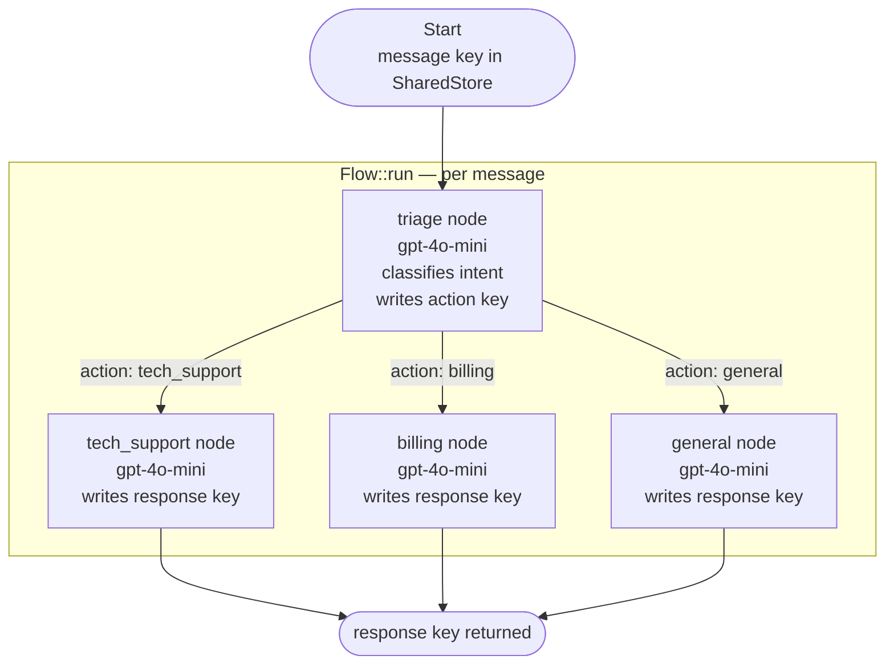

# Conditional Routing Tutorial

## What this example is for

This example demonstrates the **Conditional Routing** pattern in AgentFlow. It builds a real-world, LLM-powered triage system that classifies incoming customer service messages and routes them to the appropriate specialist agent.

**Primary AgentFlow pattern:** `Conditional Routing`  
**Why you would use it:** When different inputs require different processing paths, and you want an LLM to decide which path to take at runtime.

---

## Execution diagram



**AgentFlow patterns used:** `Flow` · `create_node` · Conditional routing via `action` key

| Node | Role |
|---|---|
| `triage` | LLM classifies intent; writes `action` = `tech_support` / `billing` / `general` |
| `tech_support` | Specialist agent for technical issues |
| `billing` | Specialist agent for billing queries |
| `general` | Catch-all agent for everything else |

---

## How to run

Set `OPENAI_API_KEY` in your environment or `.env`, then:

```bash
cargo run --example routing
```

## Key concepts

### `Flow` + edge-based routing

AgentFlow uses the string value written to the `action` key to select the next node:

```rust
flow.add_edge("triage", "tech_support", "tech_support");
flow.add_edge("triage", "billing",      "billing");
flow.add_edge("triage", "general",      "general");
```

### LLM-driven triage

The triage node calls an LLM with a strict system prompt to return exactly one of the three intent labels:

```rust
const TRIAGE_SYSTEM: &str =
    "Classify the message into exactly one category: \
     tech_support, billing, or general. \
     Respond with only the category name.";
```

### Specialist nodes

Each specialist node reads `message` from the store, calls its own LLM with a role-specific system prompt, and writes the result to `response`.

## What to expect

Running this example routes three sample messages through the triage system and prints the specialist agent's response for each one.
