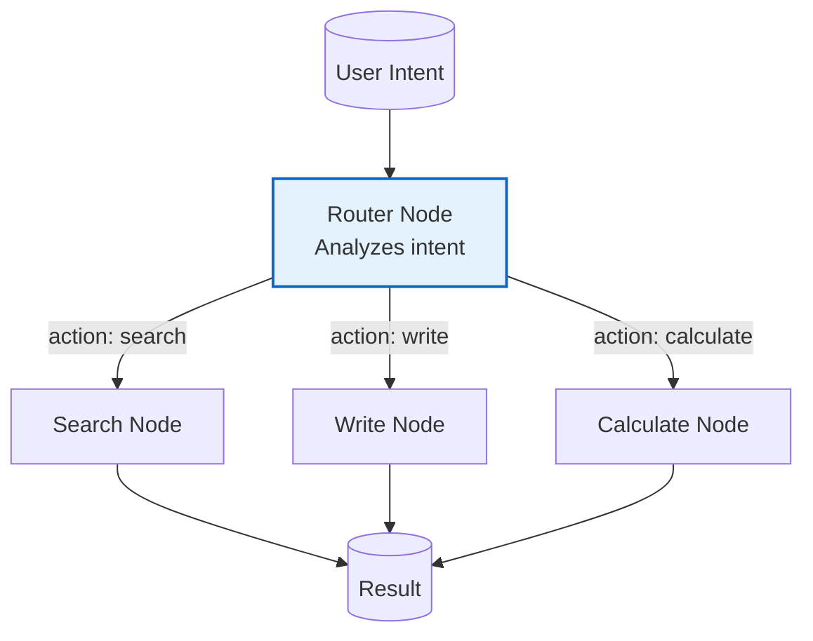

# Example: routing

*This documentation is automatically generated from the source code.*

# Example: routing.rs

Real-world LLM-powered intent routing. A Triage node calls an LLM to classify
a customer message into one of three intents (tech_support, billing, general)
and routes it to the appropriate specialist agent — also LLM-backed.

Domain: customer service inbox routing.

Requires: OPENAI_API_KEY
Run with: cargo run --example routing

## Implementation Architecture

