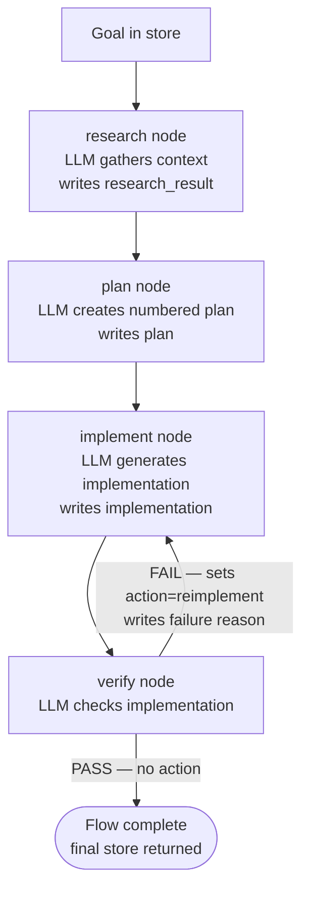

# Research → Plan → Implement → Verify (RPI) Workflow

## What this example is for

This example demonstrates the `RpiWorkflow` pattern in AgentFlow — a four-phase LLM pipeline that takes a high-level goal through research, planning, implementation, and verification.

**Primary AgentFlow pattern:** `RpiWorkflow`  
**Why you would use it:** When you need a structured, multi-phase agent loop that separates concerns (research context → plan steps → implement → verify quality), with automatic retry on failure. The verify phase can signal `FAIL:<reason>` to loop back to the implement phase.

## How the example works

1. A **research** node calls an LLM to gather background knowledge for the goal and writes it to the store.
2. A **plan** node calls an LLM to produce a numbered implementation plan from the research output.
3. An **implement** node calls an LLM to generate code or content following the plan.
4. A **verify** node calls an LLM to check the implementation. If it returns `PASS`, the workflow completes. If it returns `FAIL:<reason>`, the flow loops back to `implement` (via `reimplement` action) with the failure reason written to the store for the next attempt.
5. `RpiWorkflow` is built on `Flow::new().with_max_steps(30)` internally, allowing the implement→verify→reimplement cycle to repeat up to ~7 times.

## Execution diagram



**AgentFlow patterns used:** `RpiWorkflow` · `create_node` · implement→verify loop with `reimplement` action

## Key implementation details

- The example source is `examples/rpi.rs`.
- `RpiWorkflow` is constructed via a builder API: `.with_research(node).with_plan(node).with_implement(node).with_verify(node)`.
- The verify node signals failure by writing `"action" = "reimplement"` and `"failure_reason"` into the store before returning; the implement node reads `"failure_reason"` on subsequent attempts to adjust its output.
- `RpiWorkflow` uses `Flow::with_max_steps(30)` internally — 4 phases + up to ~7 implement/verify retry cycles.
- When an LLM provider is used, the example relies on `rig` and environment-provided credentials.

## Build your own with this pattern

```rust
use agentflow::patterns::rpi::RpiWorkflow;
use agentflow::core::node::create_node;

let workflow = RpiWorkflow::new()
    .with_research(research_node)
    .with_plan(plan_node)
    .with_implement(implement_node)
    .with_verify(verify_node);

let final_store = workflow.run(store).await;
```

### Customization ideas

- Swap the LLM calls in each phase with your own domain logic (e.g., research = web scrape, implement = code gen, verify = test runner).
- Add more context to the store before calling `.run()` (e.g., `"constraints"`, `"examples"`).
- Read `"implementation"` and `"verification_result"` from the final store for downstream processing.

## How to run

```bash
export OPENAI_API_KEY=sk-...
cargo run --example rpi
```

## Requirements and notes

Requires `OPENAI_API_KEY` for all four LLM phases. No special feature flags needed.
