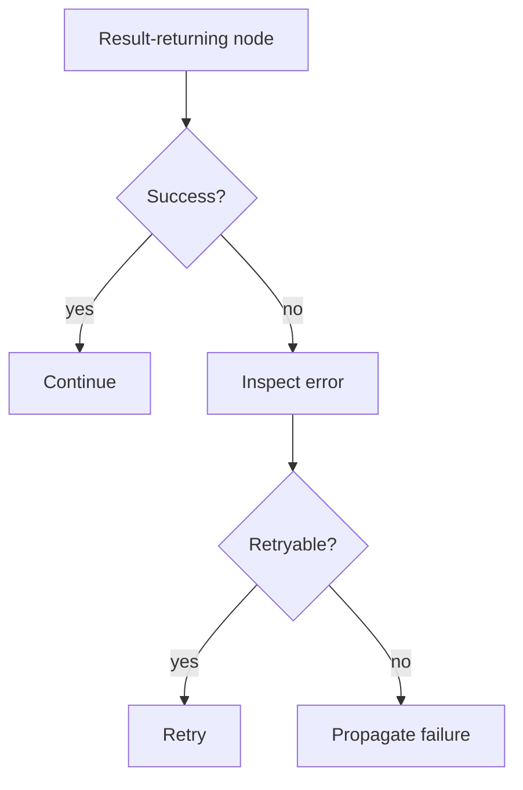

# Retry with RPITIT / Result Pattern

## What this example is for

This example demonstrates the `Retry with RPITIT / Result Pattern` pattern in AgentFlow.

**Primary AgentFlow pattern:** `Result / retry pattern`  
**Why you would use it:** return typed failures and retry only when appropriate.

## How the example works

1. Real-world Research → Plan → Implement → Verify (RPI) workflow with live LLM
2. store. The Verify phase returns either PASS or FAIL:<reason>; on FAIL the flow
3. Run with: cargo run --example rpi
4. .unwrap_or("")
5. g.insert(
6. println!("=== RPI Workflow ===");

## Execution diagram



## Key implementation details

- The example source is `examples/rpi.rs`.
- It uses AgentFlow primitives to move data through a store, flow, or higher-level pattern wrapper.
- The implementation is meant to be adapted by swapping in your own prompts, tool handlers, retrieval logic, or business rules.
- When an LLM provider is used, the example relies on `rig` and environment-provided credentials.

## Build your own with this pattern

Use the same pattern in your own project like this:

```rust
let retriable = Agent::with_retry(result_node, 5, 250);
let output = retriable.call(store).await?;
```

### Customization ideas

- Use this when you need to return typed failures and retry only when appropriate.
- Replace the demo prompts, tools, or handlers with your application logic.
- Persist or forward the final result at your system boundary.

## How to run

```bash
cargo run --example rpi
```

## Requirements and notes

No special credentials are needed unless your result nodes call external systems.
