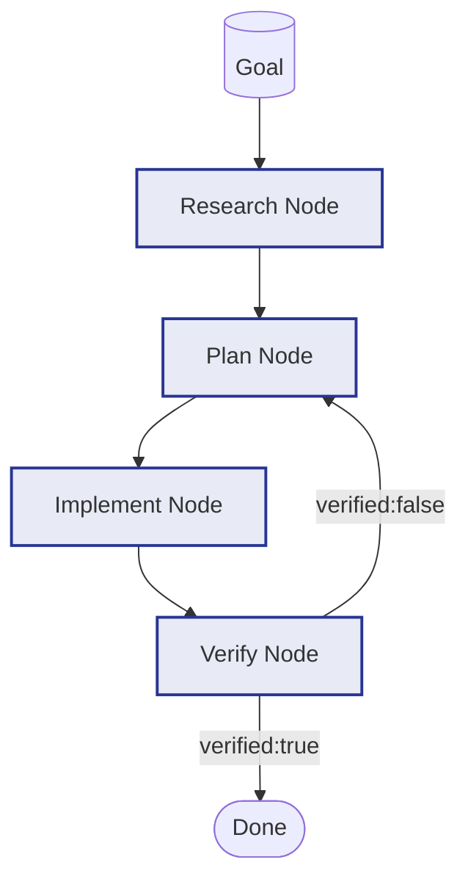

# Example: rpi

*This documentation is generated from the source code.*

# Example: rpi.rs

**Purpose:**
Demonstrates AgentFlow's `RpiWorkflow` (Research → Plan → Implement → Verify) pattern — a four-phase pipeline for autonomous software development tasks with a loopback on failure.

**How it works:**
1. **Research node** — Gathers context, reads docs, and summarises relevant findings.
2. **Plan node** — Converts research into a step-by-step implementation plan.
3. **Implement node** — Executes each plan step, producing artefacts (code, config, etc.).
4. **Verify node** — Runs tests or checks artefacts; writes `verified = true/false`.
5. **Router** — If `verified == false`, loops back to the Plan node; otherwise terminates.
6. `flow.with_max_steps(n)` prevents infinite retry loops.

**How to adapt:**
- Replace the implement node with a real code-generation + file-write node.
- Use `create_corrective_retry_node` inside implement for self-correcting code generation.
- Add a human-approval step between implement and verify for sensitive changes.

**Requires:** `OPENAI_API_KEY`
**Run with:** `cargo run --example rpi`

---

## Implementation Architecture

