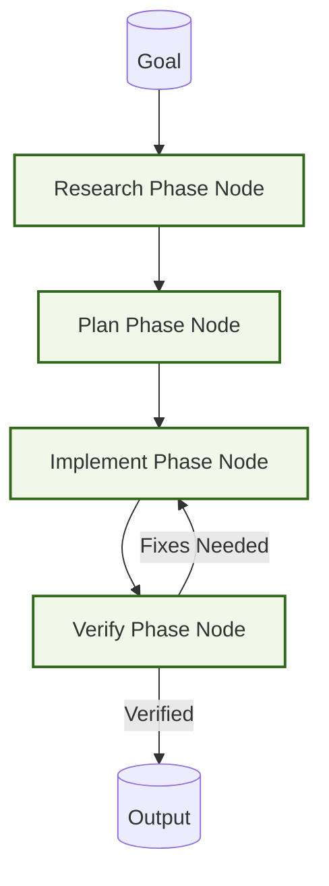

# Example: rpi

*This documentation is automatically generated from the source code.*

# Example: rpi.rs

Real-world Research → Plan → Implement → Verify (RPI) workflow with live LLM
calls at every phase. Each phase passes its output to the next via the shared
store. The Verify phase returns either PASS or FAIL:<reason>; on FAIL the flow
loops back to Implement for a revision.

Domain: generating a production-quality Rust function from a spec.

Requires: OPENAI_API_KEY
Run with: cargo run --example rpi

## Implementation Architecture

