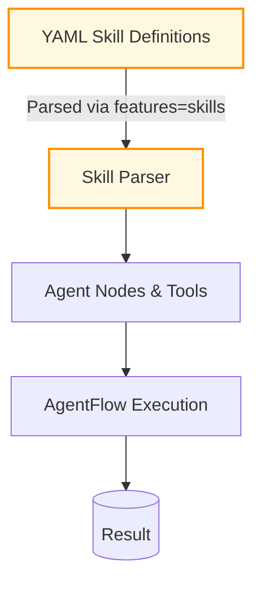

# Example: rust_agentic_skills

*This documentation is automatically generated from the source code.*

# Example: rust_agentic_skills.rs

Real-world RPI workflow driven by a Skill file and real LLM calls. The skill
defines the agent's persona and instructions. Each RPI phase (Research, Plan,
Implement, Verify) calls the LLM with that context.

Domain: generating a Rust CLI tool from a spec using the Skill system.

Requires: OPENAI_API_KEY, `skills` feature
Run with: cargo run --example rust-agentic-skills --features skills

## Implementation Architecture

