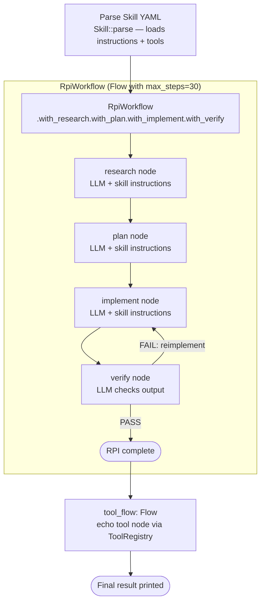

# Rust Agentic Skills

## What this example is for

This example demonstrates the `Rust Agentic Skills` pattern in AgentFlow.

**Primary AgentFlow pattern:** `Skills`  
**Why you would use it:** load reusable behaviors and tools into agents.

## How the example works

1. A `Skill` is loaded from a YAML frontmatter block (embedded in the source) using `Skill::parse()`. The skill defines the agent's persona and instructions.
2. Four `RpiWorkflow` phase nodes (research, plan, implement, verify) are created as `create_node` closures. Each reads the skill's `instructions` from the store and uses them as an LLM preamble.
3. The nodes are wired into an `RpiWorkflow` via `.with_research().with_plan().with_implement().with_verify()`.
4. After the RPI workflow runs, an additional `Flow` with a single `echo` tool node (from `ToolRegistry`) is run to demonstrate skill-driven tool invocation.

## Execution diagram



**AgentFlow patterns used:** `RpiWorkflow` · `Skill::parse` · `ToolRegistry` · `create_node`

## Key implementation details

- The example source is `examples/rust_agentic_skills.rs`.
- It uses AgentFlow primitives to move data through a store, flow, or higher-level pattern wrapper.
- The implementation is meant to be adapted by swapping in your own prompts, tool handlers, retrieval logic, or business rules.
- When an LLM provider is used, the example relies on `rig` and environment-provided credentials.

## Build your own with this pattern

Use the same pattern in your own project like this:

```rust
use agentflow::skills::Skill;
use agentflow::patterns::rpi::RpiWorkflow;

let skill = Skill::parse(skill_content)?;
// Use skill.instructions as LLM preamble in each node
let workflow = RpiWorkflow::new()
    .with_research(research_node)
    .with_plan(plan_node)
    .with_implement(implement_node)
    .with_verify(verify_node);
let final_store = workflow.run(store).await;
```

### Customization ideas

- Use this when you need to load reusable behaviors and tools into agents.
- Replace the demo prompts, tools, or handlers with your application logic.
- Persist or forward the final result at your system boundary.

## How to run

```bash
cargo run --features="skills" --example rust-agentic-skills
```

## Requirements and notes

Requires the `skills` feature and any files/tools referenced by your skill definitions.
