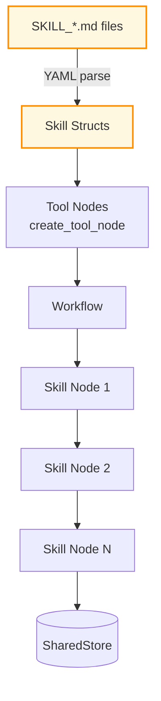

# Example: rust_agentic_skills

*This documentation is generated from the source code.*

# Example: rust_agentic_skills.rs

**Purpose:**
Demonstrates AgentFlow's `skills` feature — YAML-defined agent personas, instructions, and tool bindings loaded at runtime without recompiling.

**How it works:**
1. Loads skill definitions from `examples/SKILL_*.md` files (YAML front matter).
2. Parses each skill into a `Skill` struct (name, description, tools, persona, instructions).
3. Builds `create_tool_node` instances from the parsed tool definitions.
4. Runs a `Workflow` that sequences the skill nodes.
5. Prints all store values at the end.

**How to adapt:**
- Add a new skill by creating a new `SKILL_*.md` file — no Rust changes needed.
- Combine with an LLM agent node to let the LLM dynamically select which skill to invoke.
- Use `ToolRegistry` instead of raw `create_tool_node` for allowlist enforcement.

**Requires:** `OPENAI_API_KEY`, `--features skills`
**Run with:** `cargo run --example rust-agentic-skills --features skills`

This example loads skill definitions from markdown files with YAML front matter.
You can change tool wiring and skill metadata by editing the skill files in
`examples/` without modifying the Rust example source.

Primary skill input files: `examples/SKILL_*.md`

---

## Skill YAML Schema

```yaml
---
name: my_skill
version: 1.0.0
description: "What this skill does"
persona: "You are a ..."
tools:
  - name: "tool_name"
    description: "What the tool does"
    command: "binary"
    args: ["--flag", "{{store_key}}"]
    timeout_secs: 30
```

---

## Implementation Architecture


