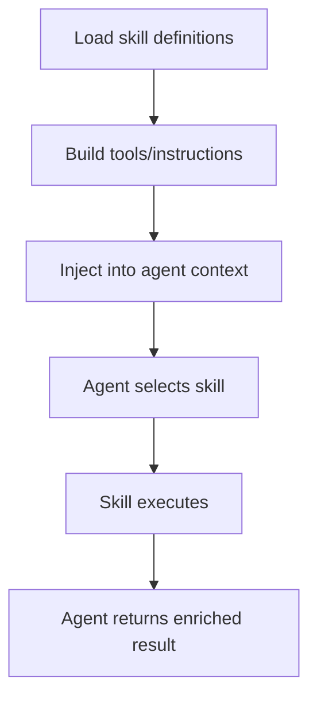

# Rust Agentic Skills

## What this example is for

This example demonstrates the `Rust Agentic Skills` pattern in AgentFlow.

**Primary AgentFlow pattern:** `Skills`  
**Why you would use it:** load reusable behaviors and tools into agents.

## How the example works

1. # Example: rust_agentic_skills.rs
2. Real-world RPI workflow driven by a Skill file and real LLM calls. The skill
3. defines the agent's persona and instructions. Each RPI phase (Research, Plan,
4. Domain: generating a Rust CLI tool from a spec using the Skill system.
5. Run with: cargo run --example rust-agentic-skills --features skills
6. println!("=== Rust Agentic Skills ===\n");

## Execution diagram



## Key implementation details

- The example source is `examples/rust_agentic_skills.rs`.
- It uses AgentFlow primitives to move data through a store, flow, or higher-level pattern wrapper.
- The implementation is meant to be adapted by swapping in your own prompts, tool handlers, retrieval logic, or business rules.
- When an LLM provider is used, the example relies on `rig` and environment-provided credentials.

## Build your own with this pattern

Use the same pattern in your own project like this:

```rust
let skill = Skill::from_yaml_file("skills/release_checklist.yaml")?;
let agent = skill.attach_to(agent);
let result = agent.call(store).await?;
```

### Customization ideas

- Use this when you need to load reusable behaviors and tools into agents.
- Replace the demo prompts, tools, or handlers with your application logic.
- Persist or forward the final result at your system boundary.

## How to run

```bash
cargo run --features="skills" --example rust_agentic_skills
```

## Requirements and notes

Requires the `skills` feature and any files/tools referenced by your skill definitions.
