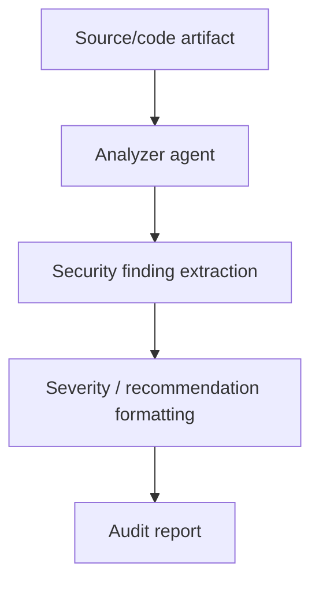

# Security Auditor

## What this example is for

This example demonstrates the `Security Auditor` pattern in AgentFlow.

**Primary AgentFlow pattern:** `Security analysis workflow`  
**Why you would use it:** specialize an agent for audit-style output.

## How the example works

1. println!("Starting Security Auditor Workflow...");
2. Crawler Flow: runs cargo clippy
3. "run_clippy",
4. create_tool_node(
5. Parallel Analysis Fan-out
6. "analyze_clippy",

## Execution diagram



## Key implementation details

- The example source is `examples/security_auditor.rs`.
- It uses AgentFlow primitives to move data through a store, flow, or higher-level pattern wrapper.
- The implementation is meant to be adapted by swapping in your own prompts, tool handlers, retrieval logic, or business rules.
- When an LLM provider is used, the example relies on `rig` and environment-provided credentials.

## Build your own with this pattern

Use the same pattern in your own project like this:

```rust
let audit_flow = Workflow::new()
    .then(findings_node)
    .then(severity_node)
    .then(report_node);
```

### Customization ideas

- Use this when you need to specialize an agent for audit-style output.
- Replace the demo prompts, tools, or handlers with your application logic.
- Persist or forward the final result at your system boundary.

## How to run

```bash
cargo run --example security_auditor
```

## Requirements and notes

Usually requires provider credentials for the analyzer agent.
