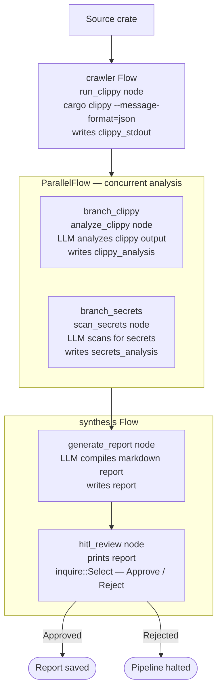

# Security Auditor

## What this example is for

This example demonstrates the `Security Auditor` pattern in AgentFlow — a multi-phase static analysis pipeline that runs `cargo clippy`, performs parallel LLM analysis, synthesizes findings into a markdown report, and gates delivery behind a human-in-the-loop approval step.

**Primary AgentFlow pattern:** `Flow + ParallelFlow + HITL`  
**Why you would use it:** When you need to combine automated tool execution, concurrent LLM analysis, and human review into a single auditable pipeline.

## How the example works

1. A **crawler** `Flow` runs `cargo clippy --message-format=json` via `create_tool_node` and writes its stdout to the store under `"clippy_stdout"`.
2. Two analysis branches run concurrently inside a `ParallelFlow`:
   - **branch_clippy**: an `analyze_clippy` node sends the clippy output to an LLM and writes `"clippy_analysis"`.
   - **branch_secrets**: a `scan_secrets` node asks an LLM to look for hardcoded secrets in the output and writes `"secrets_analysis"`.
3. A **synthesis** `Flow` runs two nodes sequentially:
   - `generate_report`: an LLM compiles both analyses into a markdown security report, writes `"report"`.
   - `hitl_review`: prints the report and prompts the user via `inquire::Select` to approve or reject it.

## Execution diagram



**AgentFlow patterns used:** `Flow` · `ParallelFlow` · `create_tool_node` · `create_node` · HITL via `inquire`

## Key implementation details

- The example source is `examples/security_auditor.rs`.
- Three separate `Flow` instances are run sequentially: `crawler.run()` → `parallel.run()` → `synthesis.run()`.
- `ParallelFlow::new(vec![branch_clippy, branch_secrets])` gives each branch a snapshot clone of the store — both branches receive `"clippy_stdout"` and write their results independently; the default merge strategy (last-writer-wins union) combines them.
- The HITL step uses `inquire::Select` (not `create_hitl_node`) — it is a blocking terminal prompt, not a `Suspended`-based async gate.
- When an LLM provider is used, the example relies on `rig` and environment-provided credentials.

## Build your own with this pattern

```rust
// 1. Crawler
let mut crawler = Flow::new();
crawler.add_node("run_clippy", create_tool_node("clippy", "cargo", vec!["clippy".into()]));

// 2. Parallel analysis
let mut branch_a = Flow::new();
branch_a.add_node("analyze", analysis_node_a);
let mut branch_b = Flow::new();
branch_b.add_node("scan", analysis_node_b);
let parallel = ParallelFlow::new(vec![branch_a, branch_b]);

// 3. Synthesis + HITL
let mut synthesis = Flow::new();
synthesis.add_node("generate_report", report_node);
synthesis.add_node("hitl_review", hitl_node);

// Run sequentially
let store = crawler.run(store).await;
let store = parallel.run(store).await;
let _store = synthesis.run(store).await;
```

### Customization ideas

- Replace `cargo clippy` with any static analysis tool (`semgrep`, `trivy`, `bandit`, etc.).
- Add more parallel branches for different analysis types (license audit, dependency CVE scan, etc.).
- Replace the `inquire` HITL step with `create_hitl_node` for async webhook-based approval.

## How to run

```bash
export OPENAI_API_KEY=sk-...
cargo run --example security_auditor
```

## Requirements and notes

Requires `OPENAI_API_KEY`. The `inquire` interactive prompt requires a real terminal (TTY) — it will not work in a piped or non-interactive shell.
