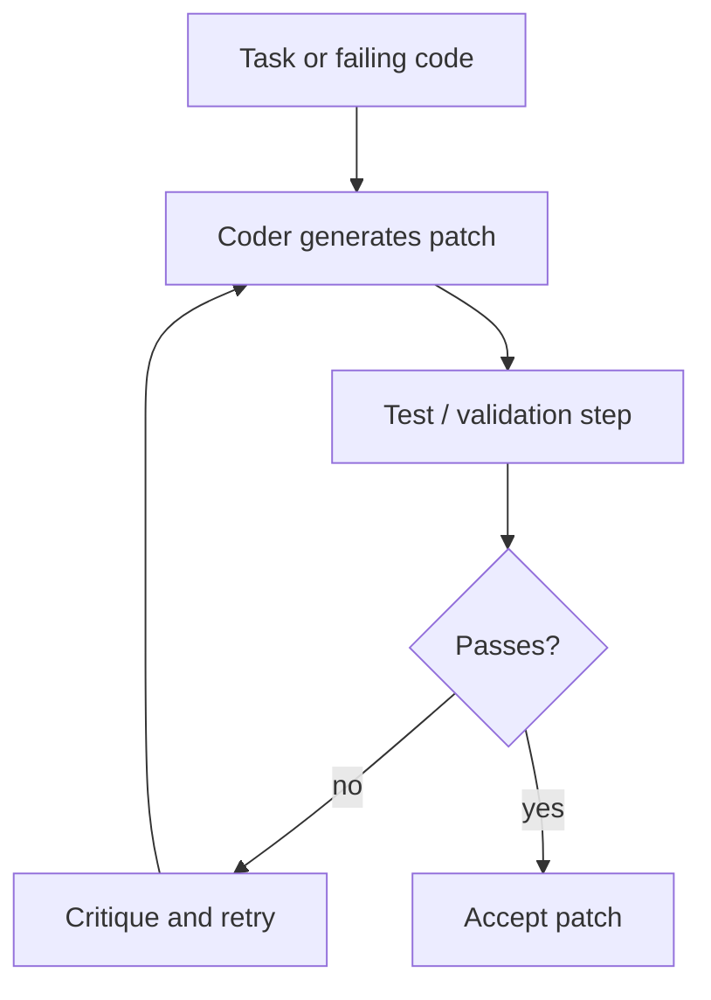

# Self-Correcting Coder

## What this example is for

This example demonstrates the `Self-Correcting Coder` pattern in AgentFlow.

**Primary AgentFlow pattern:** `Self-correction loop`  
**Why you would use it:** Generate, validate, and repair code iteratively.

## How the example works

1. The workflow starts by printing a banner: `Starting Self-Correcting Coder Workflow...`.
2. A sub-flow generates candidate code or patches for a given task.
3. A compile or test node builds and runs the generated code, capturing any failures.
4. If validation fails, a critique-and-repair node asks the model to analyze errors and propose a revised patch.
5. The loop repeats until the code passes validation or a retry limit is reached.

## Execution diagram



## Key implementation details

- The example source is `examples/self_correcting_coder.rs`.
- It uses AgentFlow primitives to move data through a store, flow, or higher-level pattern wrapper.
- The implementation is meant to be adapted by swapping in your own prompts, tool handlers, retrieval logic, or business rules.
- When an LLM provider is used, the example relies on `rig` and environment-provided credentials.

## Build your own with this pattern

Use the same pattern in your own project like this:

```rust
let coder = Workflow::new()
    .then(generate_patch_node)
    .then(test_node)
    .then(repair_node);
```

### Customization ideas

- Use this when you need to generate, validate, and repair code iteratively.
- Replace the demo prompts, tools, or handlers with your application logic.
- Persist or forward the final result at your system boundary.

## How to run

```bash
cargo run --example self_correcting_coder
```

## Requirements and notes

Usually requires provider credentials and local validation tooling if tests/commands are executed.
