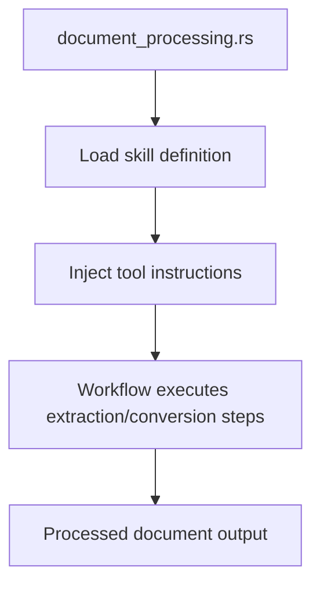

# SKILL_DOC_PROCESS

## What this file is for

This file defines the document-processing skill content used by `examples/document_processing.rs`.
It is not a standalone runnable example; instead, it supplies tool metadata and instructions that the example loads at runtime.

## How it works

1. The document-processing example loads this markdown/YAML-backed skill definition.
2. The skill exposes tool instructions for operations such as conversion or document handling.
3. AgentFlow injects the skill into the agent workflow so the pipeline can call the configured tools.
4. The workflow uses those capabilities during extraction/conversion steps.

## Relationship to the example



## Reusing this pattern

If you want your own example to load reusable capabilities from a file, keep the workflow in code and move the reusable tool instructions into a skill file like this one.

```rust
// Load the skill definition from the markdown file
let skill = Skill::from_file("examples/SKILL_DOC_PROCESS.md").await?;
// Use skill.instructions as LLM preamble and skill.tools for tool nodes
```
