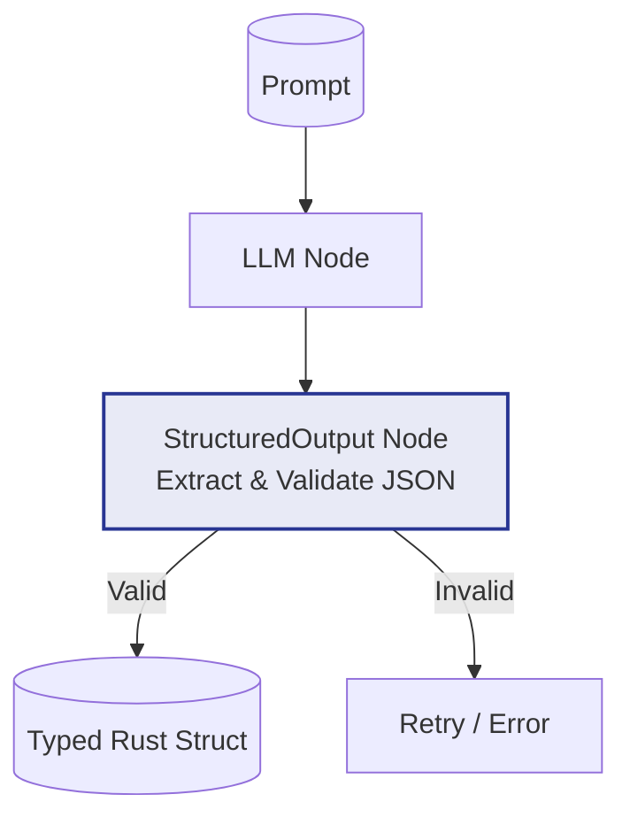

# Example: structured_output

*This documentation is automatically generated from the source code.*

# Example: structured_output.rs

**Purpose:**
Implements a multi-agent, interactive TUI pipeline for research, summarization, and critique, with structured output and user-driven control.


## Implementation Architecture



**How it works:**
- The user enters a topic via a TUI menu.
- Three LLM agents run in sequence: research, summarize, critique.
- The output is structured as a JSON object and prettified for the user.
- The user can revise (re-run all agents) or cancel at any time.

**How to adapt:**
- Use this pattern for any multi-step, multi-agent pipeline where structured output and user control are important (e.g., report generation, content review, multi-stage analysis).
- Change the agent prompts and structuring logic to fit your domain.

**Example:**
```rust
let pipeline = StructuredOutput::new(
    create_node(move |store| { ... })
);
let result = pipeline.call(store).await;
```