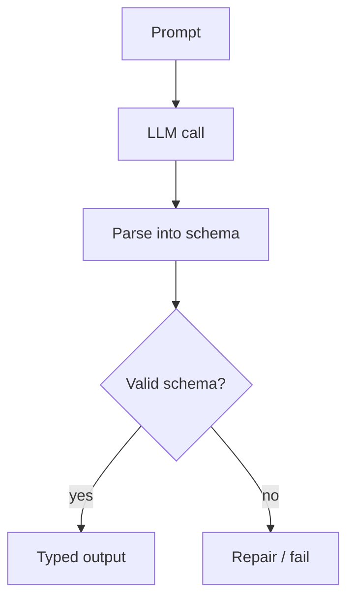

# Structured Output

## What this example is for

Implements a multi-agent, interactive TUI pipeline for research, summarization, and critique, with structured output and user-driven control.

**Primary AgentFlow pattern:** `StructuredOutput`  
**Why you would use it:** force responses into a schema you can parse safely.

## How the example works

1. The user enters a topic via a TUI menu.
2. Three LLM agents run in sequence: research, summarize, critique.
3. The output is structured as a JSON object and prettified for the user.
4. The user can revise (re-run all agents) or cancel at any time.

## Execution diagram



## Key implementation details

- The example source is `examples/structured_output.rs`.
- It uses AgentFlow primitives to move data through a store, flow, or higher-level pattern wrapper.
- The implementation is meant to be adapted by swapping in your own prompts, tool handlers, retrieval logic, or business rules.
- When an LLM provider is used, the example relies on `rig` and environment-provided credentials.

## Build your own with this pattern

Use the same pattern in your own project like this:

```rust
#[derive(Deserialize)]
struct TicketSummary { priority: String, owner: String }

let parser = StructuredOutput::<TicketSummary>::new(schema_node);
let typed = parser.run(store).await?;
```

### Customization ideas

- Use this pattern for any multi-step, multi-agent pipeline where structured output and user control are important (e.g., report generation, content review, multi-stage analysis).
- Change the agent prompts and structuring logic to fit your domain.

## How to run

```bash
cargo run --example structured_output
```

## Requirements and notes

Usually requires provider credentials for schema-constrained generation.
