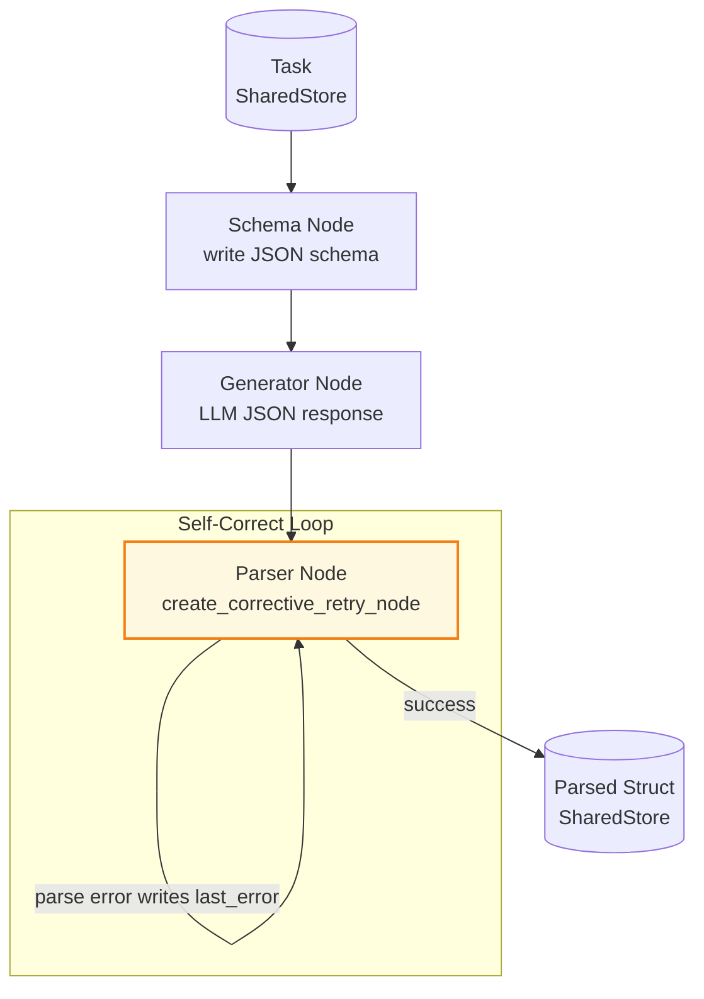

# Example: structured_output

*This documentation is generated from the source code.*

# Example: structured_output.rs

**Purpose:**
Demonstrates forcing an LLM to return a specific JSON schema using AgentFlow's `StructuredOutput` pattern, with `create_corrective_retry_node` for self-correcting JSON extraction.

**How it works:**
1. **Schema node** — Writes the expected JSON schema to the store.
2. **Generator node** — LLM is prompted to respond _only_ in the specified schema.
3. **Parser node** — Uses `create_corrective_retry_node`: tries to parse the LLM response as the target type; on failure writes the error to `last_error` so the next attempt can self-correct.
4. **Flow** — Routes to the parser loop; terminates when parsing succeeds or `max_attempts` is exceeded.

**How to adapt:**
- Change the Rust struct and `serde` attributes to match any desired JSON schema.
- Increase `max_attempts` for complex schemas that may require several correction rounds.
- Combine with `TypedFlow<T>` to pass the parsed struct directly to downstream nodes without store serialisation.

**Requires:** `OPENAI_API_KEY`
**Run with:** `cargo run --example structured-output`

---

## Implementation Architecture

