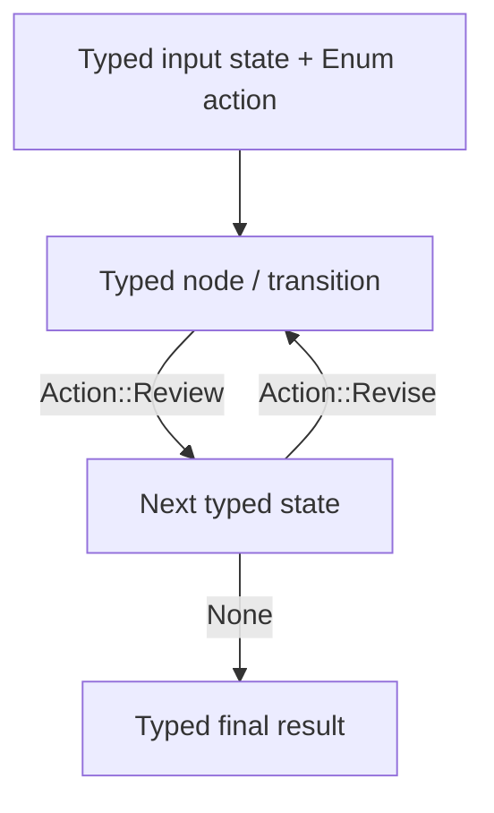

# Typed Flow

## What this example is for

This example demonstrates the `Typed Flow` pattern in AgentFlow.

**Primary AgentFlow pattern:** `TypedFlow<T, E>`  
**Why you would use it:** To model state transitions with compile-time, enum-based state types and actions.

## How the example works

1. # Example: typed_flow.rs
2. Real-world TypedFlow example: a multi-stage content pipeline backed by a real
3. count. The flow loops through Draft → Critique → Revise until the LLM critic
   approves or the revision limit is reached.
4. This showcases TypedFlow's key advantage over the HashMap-based Flow: the state 
   is a plain Rust struct and routing is driven by enum variants (`Option<E>`). No string key lookups, full type safety, and guaranteed routing paths.
5. Additionally, the nodes pass state as owned lock-free message passing, eliminating locking contention.

## Execution diagram



## Key implementation details

- The example source is `examples/typed_flow.rs`.
- It uses AgentFlow primitives to move owned state data through a flow in a lock-free actor model.
- The implementation is meant to be adapted by swapping in your own prompts, tool handlers, retrieval logic, or business rules.
- When an LLM provider is used, the example relies on `rig` and environment-provided credentials.

## Build your own with this pattern

Use the same pattern in your own project like this:

```rust
use agentflow::core::typed_flow::{TypedFlow, create_typed_node};
use agentflow::core::typed_store::TypedStore;

#[derive(Clone)]
enum Action { Next, Revise }

#[derive(Clone)]
struct MyState { draft: String, approved: bool }

let draft_node = create_typed_node(|mut store: TypedStore<MyState>| async move {
    store.inner.draft = "Draft content".into();
    (store, Some(Action::Next))
});

let review_node = create_typed_node(|mut store: TypedStore<MyState>| async move {
    store.inner.approved = true;
    (store, None) // None halts the flow
});

let mut flow: TypedFlow<MyState, Action> = TypedFlow::new().with_max_steps(10);
flow.add_node("draft", draft_node);
flow.add_node("review", review_node);
flow.add_edge("draft", Action::Next, "review");

let initial = TypedStore::new(MyState { draft: String::new(), approved: false });
let result = flow.run(initial).await;
```

- Nodes return `(TypedStore<T>, Option<E>)` — `None` halts the flow, `Some(variant)` routes to the registered edge target.
- State transitions use enum variants registered via `flow.add_edge("from", Action::Variant, "to")`.
- No `.step()` builder exists — always use `add_node` + `add_edge`.

### Customization ideas

- Use this when you need to model transitions with compile-time state types.
- Replace the demo prompts, tools, or handlers with your application logic.
- Persist or forward the final result at your system boundary.

## How to run

```bash
cargo run --example typed_flow
```

## Requirements and notes

No credentials required unless your typed nodes call external services.
