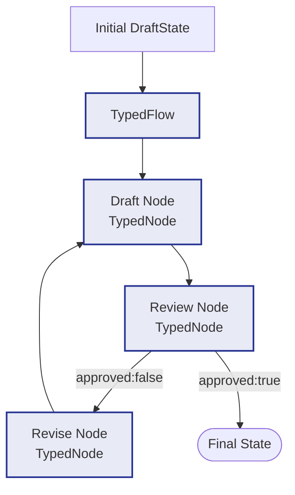

# Example: typed_flow

*This documentation is generated from the source code.*

# Example: typed_flow.rs

**Purpose:**
Demonstrates `TypedFlow<T>` — a compile-time typed state machine where the state is a plain Rust struct and transitions are closures, eliminating all `HashMap` key lookups and `serde_json::Value` casts.

**How it works:**
- Defines a `DraftState` struct with typed fields (`content`, `revision`, `approved`).
- Creates `TypedNode<DraftState>` closures for `draft`, `revise`, and `review` stages.
- Adds typed transitions: closures `|&DraftState| -> Option<String>` returning the next node name.
- `TypedFlow::run(initial_state)` drives the machine until a transition returns `None`.

**How to adapt:**
- Use `TypedFlow` whenever the state schema is fixed at compile time — you get type-checked field access and zero runtime key-error risk.
- Use `Flow` when the state schema is dynamic or when integrating with external JSON APIs.
- Combine `TypedFlow` with `create_diff_node`-style closures by capturing state fields directly (no store lock needed).

**Requires:** No API key needed for the demo; add LLM calls inside typed nodes for real use.
**Run with:** `cargo run --example typed-flow`

This is a self-contained example. It does not require any model provider
configuration and is the quickest way to verify `TypedFlow<T>` behavior without
external services.

---

## Implementation Architecture



**Example:**
```rust
let mut flow: TypedFlow<DraftState> = TypedFlow::new("draft");

flow.add_node("draft",  create_typed_node(|mut s: DraftState| async move {
    s.content = generate_draft(&s.prompt).await;
    s
}));

flow.add_transition("draft", |s| Some("review".into()));

flow.add_node("review", create_typed_node(|mut s: DraftState| async move {
    s.approved = review_draft(&s.content).await;
    s
}));

flow.add_transition("review", |s| {
    if s.approved { None } else { Some("revise".into()) }
});

flow.with_max_steps(20);
let final_state = flow.run(initial).await;
```
