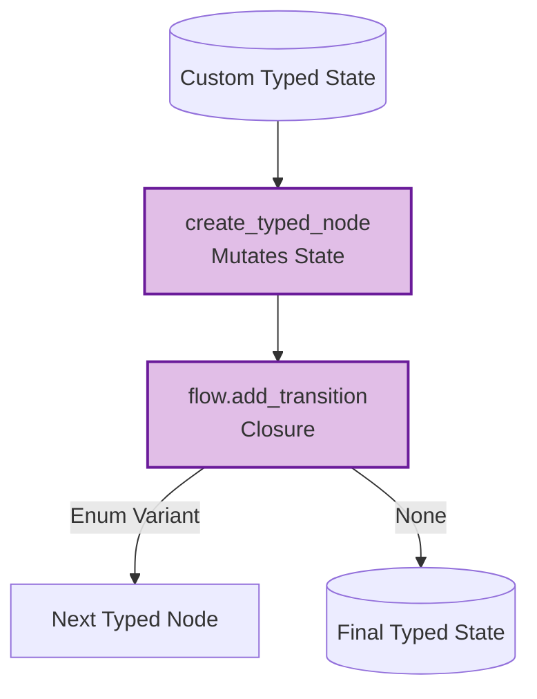

# Example: typed_flow

*This documentation is automatically generated from the source code.*

# Example: typed_flow.rs

Real-world TypedFlow example: a multi-stage content pipeline backed by a real
LLM. The typed state carries a topic, a draft, a critique, and a revision
count. The flow loops through Draft → Critique → Revise until the LLM critic
approves or the revision limit is reached.

This showcases TypedFlow's key advantage over the HashMap-based Flow: the state
is a plain Rust struct — no string key lookups, full type safety.

Requires: OPENAI_API_KEY
Run with: cargo run --example typed-flow

## Implementation Architecture

