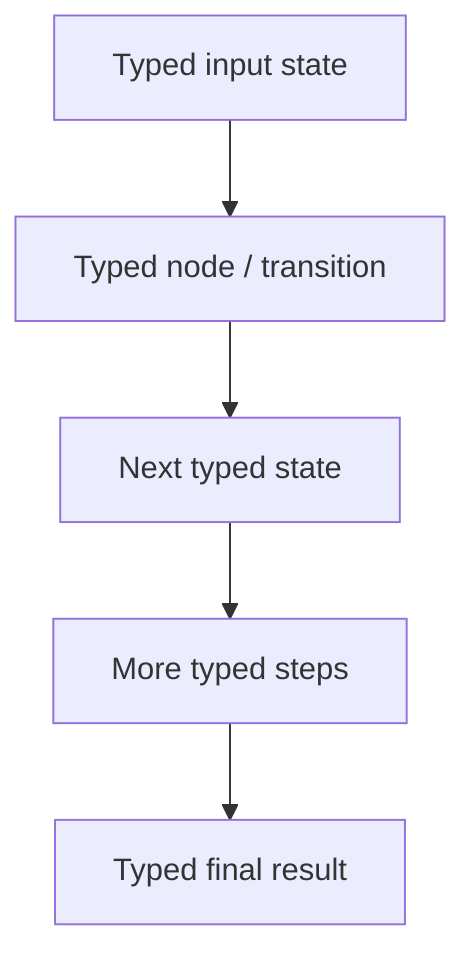

# Typed Flow

## What this example is for

This example demonstrates the `Typed Flow` pattern in AgentFlow.

**Primary AgentFlow pattern:** `TypedFlow`  
**Why you would use it:** model transitions with compile-time state types.

## How the example works

1. # Example: typed_flow.rs
2. Real-world TypedFlow example: a multi-stage content pipeline backed by a real
3. count. The flow loops through Draft → Critique → Revise until the LLM critic
4. This showcases TypedFlow's key advantage over the HashMap-based Flow: the state
5. Run with: cargo run --example typed-flow
6. .unwrap_or("")

## Execution diagram



## Key implementation details

- The example source is `examples/typed_flow.rs`.
- It uses AgentFlow primitives to move data through a store, flow, or higher-level pattern wrapper.
- The implementation is meant to be adapted by swapping in your own prompts, tool handlers, retrieval logic, or business rules.
- When an LLM provider is used, the example relies on `rig` and environment-provided credentials.

## Build your own with this pattern

Use the same pattern in your own project like this:

```rust
let flow: TypedFlow<Start, Done> = TypedFlow::new()
    .step(validate_input)
    .step(enrich_record)
    .step(persist_record);
```

### Customization ideas

- Use this when you need to model transitions with compile-time state types.
- Replace the demo prompts, tools, or handlers with your application logic.
- Persist or forward the final result at your system boundary.

## How to run

```bash
cargo run --example typed_flow
```

## Requirements and notes

No credentials required unless your typed nodes call external services.
