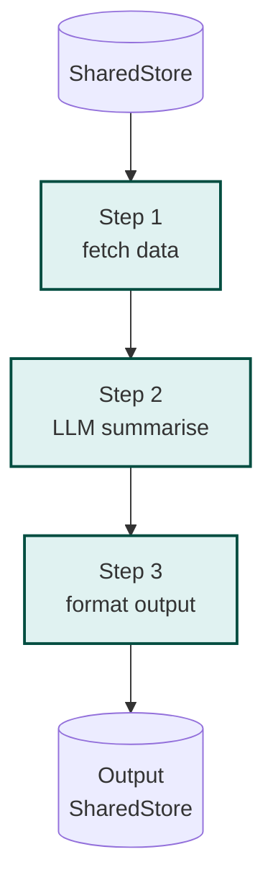

# Example: workflow

*This documentation is generated from the source code.*

# Example: workflow.rs

**Purpose:**
Demonstrates `Workflow` — a linear sequence of named steps sharing a `SharedStore`, ideal for predictable pipelines where there is no branching.

**How it works:**
1. Create a `Workflow`.
2. Add named steps with `wf.add_step("name", node)` in execution order.
3. Call `wf.execute(store).await` — steps run sequentially, each reading and writing the same store.
4. Inspect the final store for all step outputs.

**How to adapt:**
- Use `Workflow` over `Flow` when there is no conditional routing — it is simpler and easier to debug.
- Nest workflows: call `inner_wf.execute(store)` inside a node of an outer `Workflow`.
- Add a `create_diff_node` step for any LLM call to avoid holding the store lock across `.await`.

**Requires:** `OPENAI_API_KEY`
**Run with:** `cargo run --example workflow`

---

## Implementation Architecture



**Example:**
```rust
let mut wf = Workflow::new();
wf.add_step("fetch",    node_fetch_data);
wf.add_step("summarise", node_summarise);
wf.add_step("format",   node_format_output);

let result = wf.execute(store).await;
```
