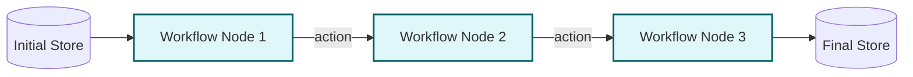

# Example: workflow

*This documentation is automatically generated from the source code.*

# Example: workflow.rs

**Purpose:**
Demonstrates a real-world, multi-step workflow for a Land Registry Agency, with Human-in-the-Loop (HITL) at each step.


## Implementation Architecture



**How it works:**
- Each step is an LLM agent: title search, title issuance, legal review.
- After each step, the result is shown to the user, who can approve, request revision, restart, or cancel.
- The workflow advances or repeats based on user input.

**How to adapt:**
- Replace the steps with your own business process (e.g., document review, multi-stage approval).
- Use the HITL pattern to add user oversight to any workflow.

**Example:**
```rust
let mut workflow = Workflow::new();
workflow.add_step("step1", ...);
workflow.add_step("step2", ...);
workflow.connect("step1", "step2");
let result = workflow.execute(store).await;
```