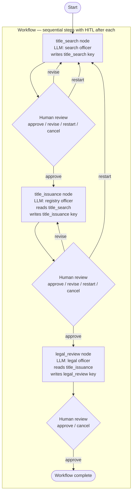
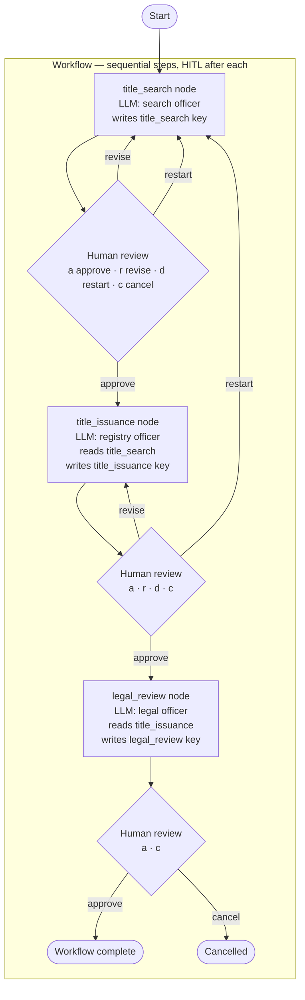
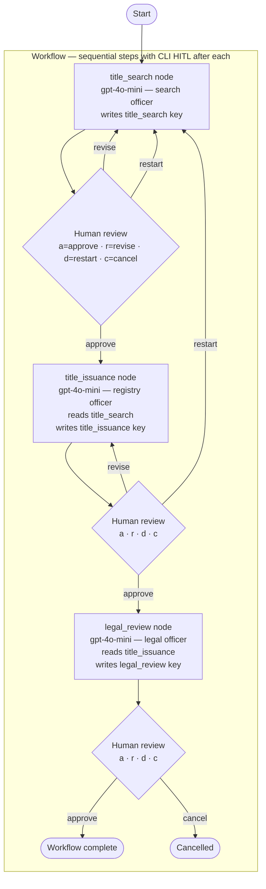
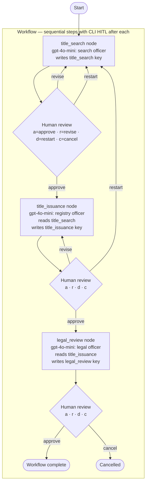
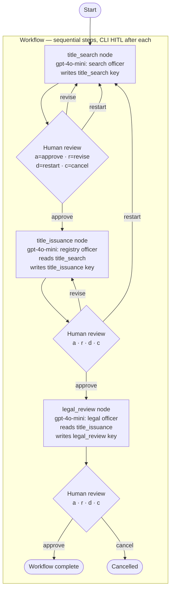

# Workflow with Human-in-the-Loop (HITL) Tutorial

## What this example is for

This example demonstrates the **Workflow** pattern combined with **Human-in-the-Loop (HITL)** in AgentFlow. It models a sequential real-world process: a Land Registry Agency pipeline.

**Primary AgentFlow pattern:** `Workflow`  
**Why you would use it:** To compose sequential application-specific steps that require manual user oversight, approvals, or revisions before moving to the next stage.

## How it works

The system is built using the `Workflow` orchestrator, which is a specialized wrapper around a `Flow` that forces sequential execution (Step 1 -> Step 2 -> Step 3).

The three steps are:
1. **`title_search`**: An LLM agent searches a property.
2. **`title_issuance`**: An LLM agent prepares the legal draft.
3. **`legal_review`**: An LLM agent reviews the legal draft.

After each step, the `Workflow` automatically pauses and prompts the user on the command line. The user can choose to:
- `[a]pprove` (continue to the next step)
- `[r]equest revision` (rerun the current step)
- `[d]eny/restart` (start the entire workflow over)
- `[c]ancel` (exit the workflow immediately)

### Step-by-Step Code Walkthrough

First, we define the agents as nodes. Each node reads the output of the previous node from the `SharedStore` and writes its own output:

```rust
// Step 2: Title Issuance Node
let title_issuance_node = create_node(move |store: SharedStore| {
    Box::pin(async move {
        // Read the result of Step 1 (title_search)
        let search_result = {
            let guard = store.write().await;
            guard.get("title_search").unwrap().to_string()
        };

        let prompt = format!(
            "Based on the title search result:\n{}\n\nPrepare a draft land title issuance.",
            search_result
        );
        let response = rig_agent.prompt(&prompt).await.unwrap();

        // Save the result for Step 3
        store.write().await.insert("title_issuance".to_string(), Value::String(response));
        store.write().await.insert("action".to_string(), Value::String("default".to_string()));
        store
    })
});
```

Next, we build the workflow and connect the steps sequentially:

```rust
let mut workflow = Workflow::new();
workflow.add_step("title_search", title_search_node);
workflow.add_step("title_issuance", title_issuance_node);
workflow.add_step("legal_review", legal_review_node);

// Connect them in order
workflow.connect("title_search", "title_issuance");
workflow.connect("title_issuance", "legal_review");
```

Finally, we execute the workflow manually in a `while let` loop to inject the **Human-in-the-Loop** prompt after every step:

```rust
let mut current_step = Some("title_search".to_string());

while let Some(step) = current_step.clone() {
    // Run exactly ONE step
    current_step = workflow.step(&step, last_result.clone()).await;

    // Prompt the user for approval
    let user_choice = prompt_user(&step, &last_result);

    match user_choice.as_str() {
        "a" | "approve" => {
            // Keep going (current_step is already set to the next step)
        }
        "r" | "request revision" => {
            current_step = Some(step); // Re-run the same step
        }
        "d" | "deny" | "restart" => {
            current_step = Some("title_search".to_string()); // Go back to start
        }
        "c" | "cancel" => break, // Exit
        _ => break,
    }
}
```

## Execution diagram



**AgentFlow patterns used:** `Workflow` · `create_node` · Human-in-the-Loop (CLI prompt after each step)

## Execution diagram



**AgentFlow patterns used:** `Workflow` · `create_node` · Sequential steps · CLI-driven Human-in-the-Loop

## Execution diagram



**AgentFlow patterns used:** `Workflow` · `create_node` · CLI Human-in-the-Loop after each step

## Execution diagram


**AgentFlow patterns used:** `Workflow` · `create_node` · CLI Human-in-the-Loop after each step

## Execution diagram


**AgentFlow patterns used:** `Workflow` · `create_node` · CLI Human-in-the-Loop after each step

## Execution diagram



**AgentFlow patterns used:** `Workflow` · `create_node` · CLI Human-in-the-Loop after each step

## Execution diagram



**AgentFlow patterns used:** `Workflow` · `create_node` · CLI Human-in-the-Loop after each step

## How to run

Ensure you have your `OPENAI_API_KEY` set in your environment or `.env` file, then run:

```bash
cargo run --example workflow
```