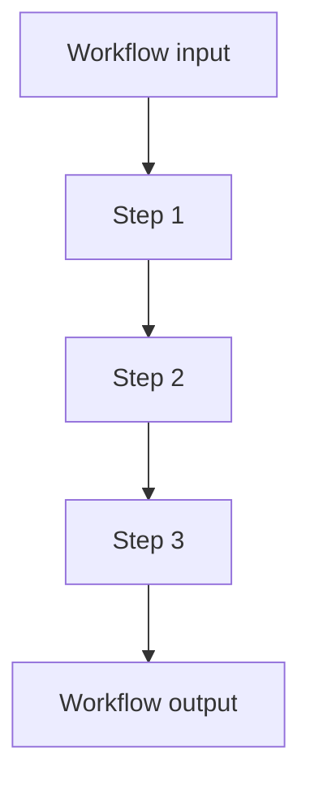

# Workflow Pattern

## What this example is for

Demonstrates a real-world, multi-step workflow for a Land Registry Agency, with Human-in-the-Loop (HITL) at each step.

**Primary AgentFlow pattern:** `Workflow`  
**Why you would use it:** compose sequential application-specific steps.

## How the example works

1. Each step is an LLM agent: title search, title issuance, legal review.
2. After each step, the result is shown to the user, who can approve, request revision, restart, or cancel.
3. The workflow advances or repeats based on user input.

## Execution diagram



## Key implementation details

- The example source is `examples/workflow.rs`.
- It uses AgentFlow primitives to move data through a store, flow, or higher-level pattern wrapper.
- The implementation is meant to be adapted by swapping in your own prompts, tool handlers, retrieval logic, or business rules.
- When an LLM provider is used, the example relies on `rig` and environment-provided credentials.

## Build your own with this pattern

Use the same pattern in your own project like this:

```rust
let onboarding = Workflow::new()
    .then(validate_user)
    .then(provision_account)
    .then(send_welcome_email);
```

### Customization ideas

- Replace the steps with your own business process (e.g., document review, multi-stage approval).
- Use the HITL pattern to add user oversight to any workflow.

## How to run

```bash
cargo run --example workflow
```

## Requirements and notes

Requirements depend on the nodes inside the workflow.
